# 为了更好的使用 Nacos 配置中心，我写了个插件

Nacos 为我们提供了非常好用的配置中心的功能，并且自带了一个控制台，但是每次更新配置时，需要对整个配置项的值进行修改，非常不方便。

如何更方便、优雅、安全的使用 Nacos 配置中心，就显得非常重要，本篇文章我将为大家介绍一种通过插件适配的方式，像操作 K-V 键值对那样更加简单的使用配置中心。

## 现有页面的问题

我们来看一下 Nacos 现有的配置管理页面可能存在什么问题，例如我有如下图所示的一个配置项：

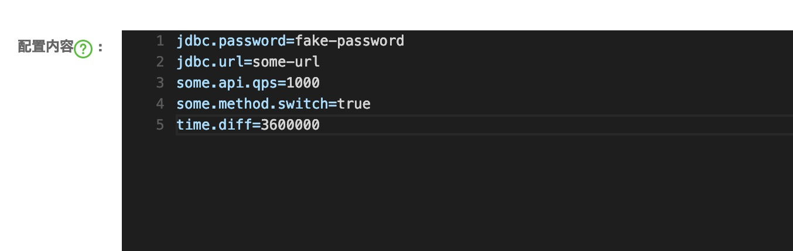

如果让用户直接在 nacos 中管理这些配置，用户将会非常头疼，原因如下：

1.对于非技术人员，诸如 jdbc.url 这种系统相关的配置项，他们不需要关心，也不应该由他们来管理这些配置项，直接暴露给他们的话，将会非常危险

2.有些配置项无法仅从 key 的命名中判断出它的意思，因为他们并没有做到那么好的自解释，例如上述配置中的 time.diff 就很具有疑惑性

3.配置的修改应该做到最小化，如果将所有的配置项全部暴露，可能会存在用户在修改时不小心将其中某一个配置项删除的情况，这将会带来灾难性的后果

4.根据权限划分的不同，配置项应该进行数据权限的隔离，不同的人应该只能看到自己所能修改的配置项，而不是看到所有配置项

## 一种更友好的页面

假设我们有一种如下图所示更友好的操作页面，那么操作将变得更容易些：

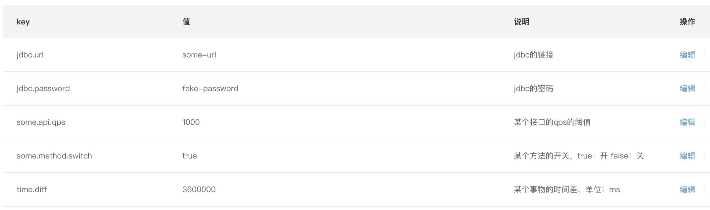

通过将一整个配置项的内容，拆分成一个个更小的配置项，再为每个配置项加上一个说明信息，在这样的页面上操作是不是比直接在 Nacos 的控制台上操作更方便、友好和安全呢？

## 设计思路

为了要实现这样的功能，我们可以在原来配置中心的基础上做一个适配层，以插件的形式对外提供配置项的查询和修改服务。

主要的架构如下图所示：

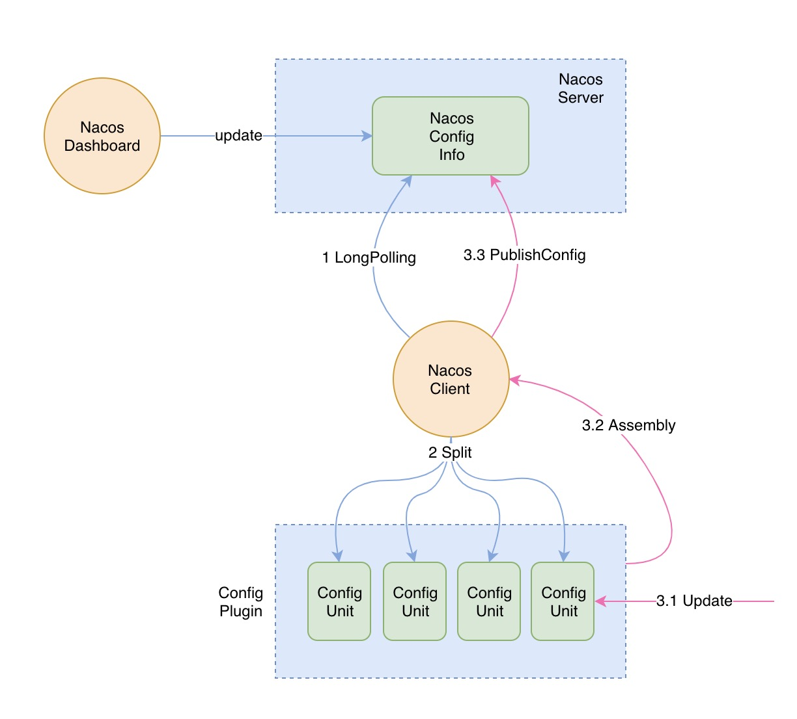

整个流程分为三个部分：

1.Nacos 客户端长轮询服务端的配置信息

2.适配层从 Nacos 客户端处获取到完整的配置信息后拆分成一个个更小的配置项

3.从适配层中对某一个配置项进行更新，然后将所有的小配置项再组装成完整的配置项通过 Nacos 客户端将内容更新到服务端

上图中的 Config Unit 就是我们需要关心的最小配置单元，通过这个配置单元，我们就可以为每个配置项指定诸如 “说明” 这样的属性。

## 配置单元需要有哪些属性

我们可以自由设计配置单元中的属性，根据业务场景我们可以为配置单元设计以下属性：

- desc：这个属性主要是用来对配置项进行描述说明
- type：标识配置项的值类型，可以用一个枚举来定义
- readOnly：标识该配置项是否是只读，如果是只读则不允许修改
- grade：指定配置项的危险等级，主要是为了做数据权限隔离

通过这些属性就可以将 Nacos 中完整的配置项拆分成小的配置单元，可以将配置单元理解为配置项的元数据，这些元数据可以保存在数据库中或者是配置文件甚至也可以保存在 Nacos 中，只要保证每个配置项都能对应一个配置单元即可。

## 插件需要有哪些能力

适配层其实只需要提供配置项的查询和更新的功能即可，查询分为查询列表和单个配置项。具体的接口定义如下图所示：

## 查看效果

下面我们来查看下效果，具体的实现过程不在这里进行详细的描述，文末有完整实现代码。

### 获取配置列表

查询 grade 小于等于 5 的所有配置项：

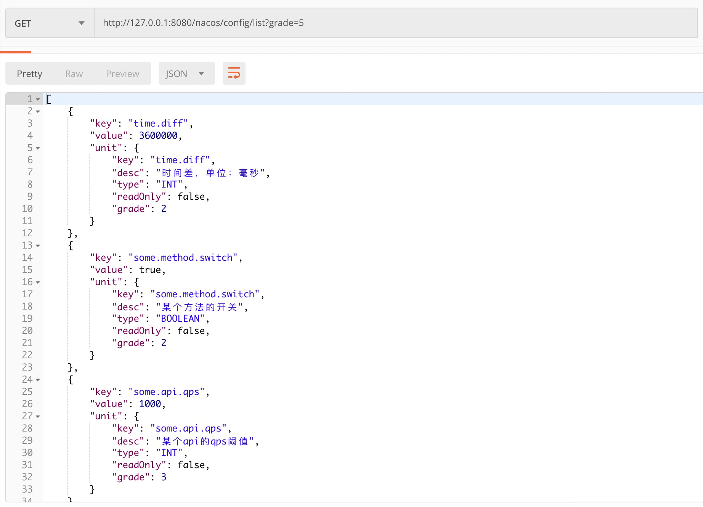

查询 grade 小于等于 2 的所有配置项：

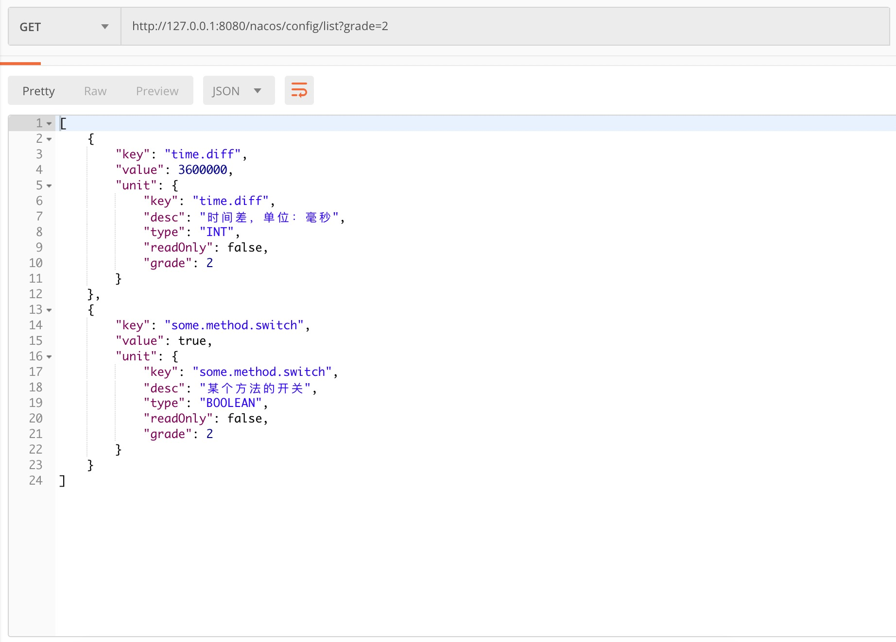

这里的 grade 一方面可以用来进行数据权限的隔离，也可以给前端作为「危险」等级展示的依据，grade 值越大的表示该配置项越危险，修改时需要格外注意。

### 查询单个配置项

根据 key 查询单个配置项：

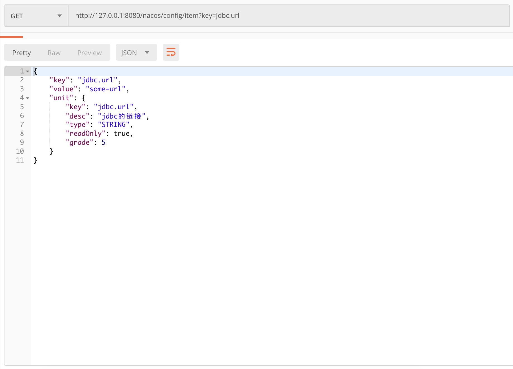

当我们系统中需要获取某个配置项的值时，就可以调用该接口。

### 更新配置项

更新一个不存在的配置项：

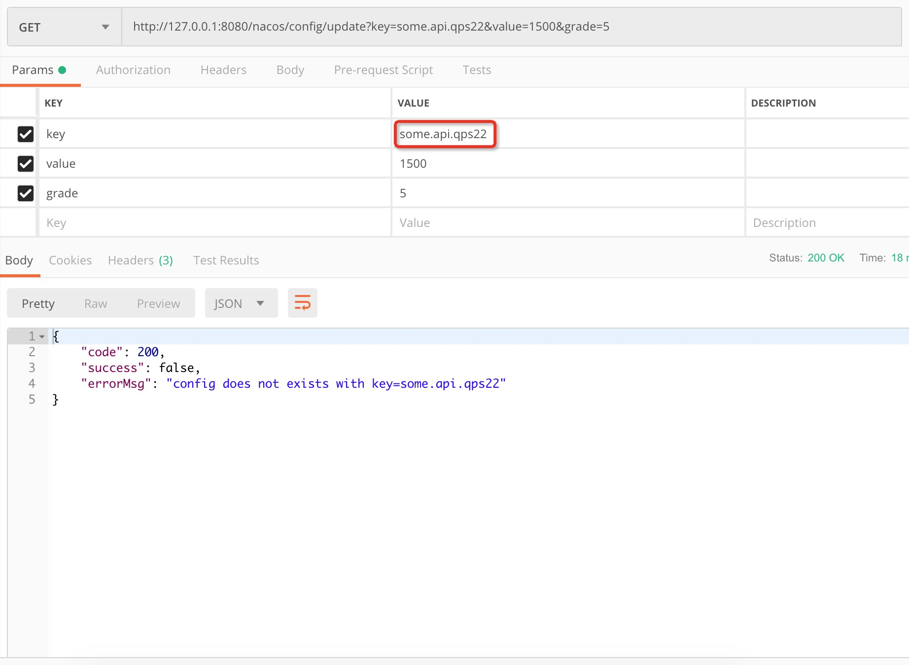

更新一个配置项，但是权限不够，提交的 grade 低于该配置项的 grade：

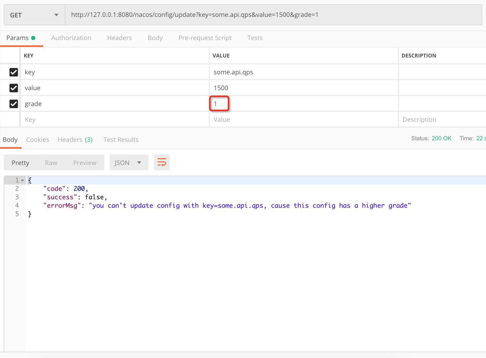

更新某个配置项，但是该配置项为只读：

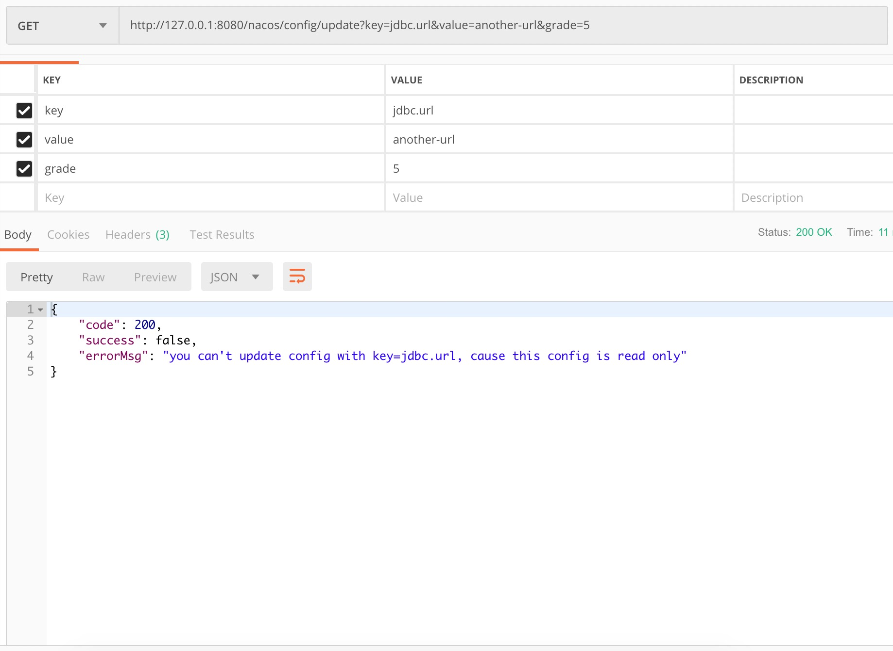

更新某个配置项，但是指定了一个错误的值类型：

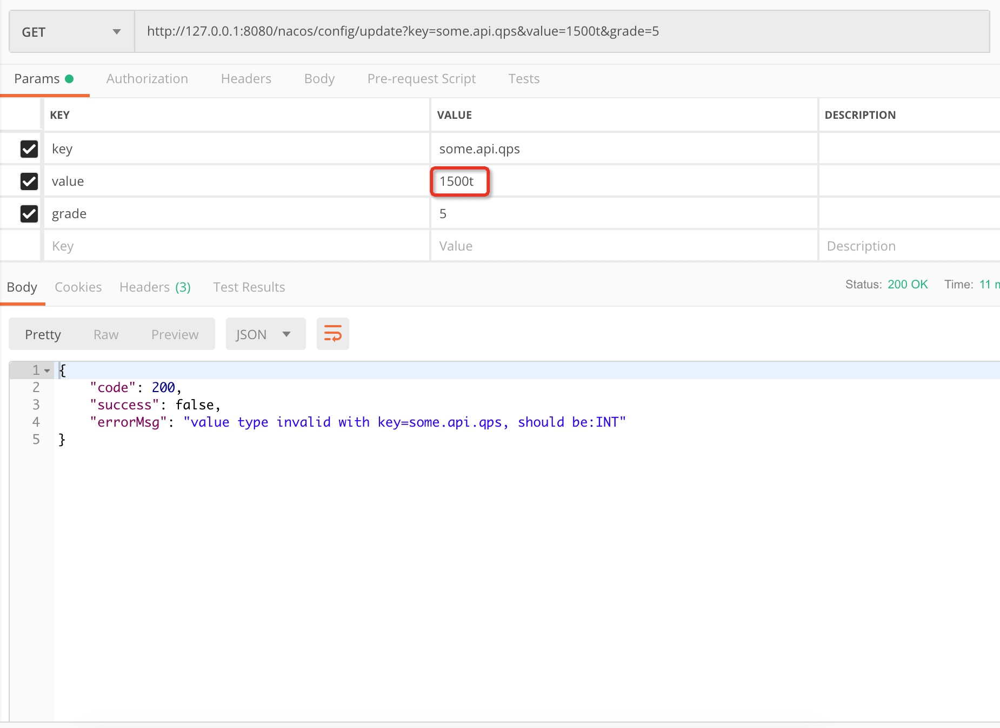

正确更新某个配置项：

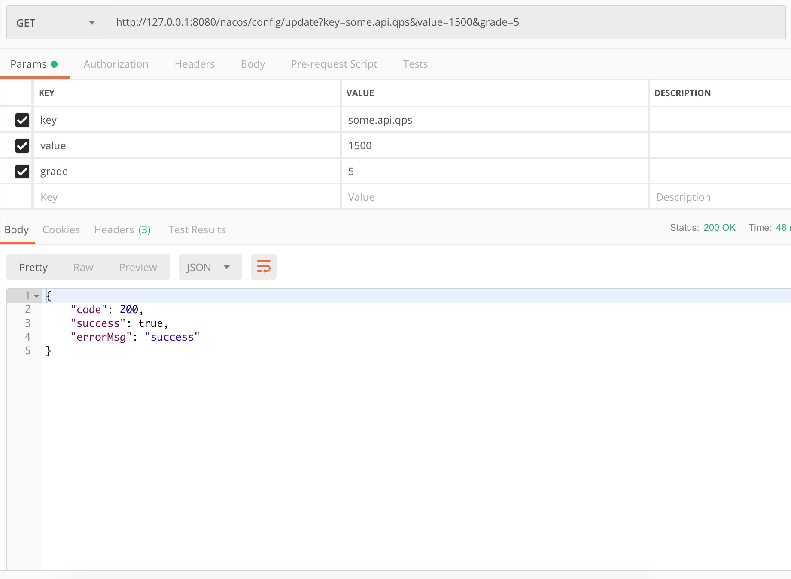

### 查看Nacos中的值

通过适配层更新完配置信息后，我们来检查下 Nacos 中的配置项是否发生了改变，如下图所示：

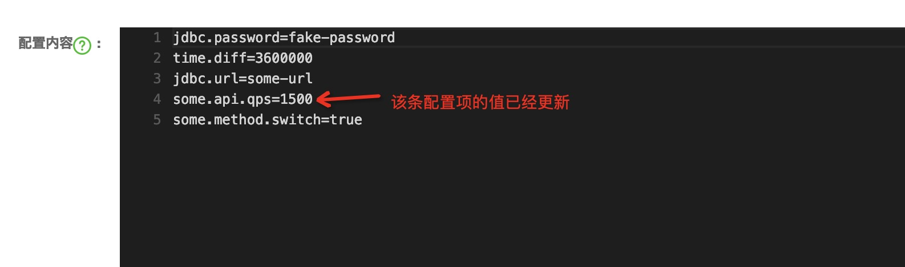

可以发现，Nacos 服务端中该配置项的值已经更新。

## 实际环境中使用

要在实际环境中使用该插件，需要解决以下几个问题：

**1、配置单元**

首先我们需要为 Nacos 中的每个配置项对应一个配置单元，为他们指定各种属性，然后将配置单元持久化到数据库或者配置文件中，方便插件进行获取配置单元的列表。

**2、权限隔离**

需要对所有的配置单元进行分类，即为他们维护好 grade，并在你们的系统中根据权限模型进行数据权限隔离，例如：

普通用户的角色可以查看并修改 grade <= 2 的配置项；

管理员角色可以查看并修改 grade<= 5 的配置项；

超级管理员角色可以查看并修改所有的配置项。

但是如果通过 grade 明文传输的话，被别人抓取到报文后，很可能伪造请求，所以最好的是结合系统的权限模块进行数据权限的整合。

## 完整代码

目前我已经实现了该插件的功能，如果需要完整的代码，可以在公众号内回复「配置中心插件」获取。