# Nacos配置中心原理

动态配置管理是 Nacos 的三大功能之一，通过动态配置服务，我们可以在所有环境中以集中和动态的方式管理所有应用程序或服务的配置信息。

动态配置中心可以实现配置更新时无需重新部署应用程序和服务即可使相应的配置信息生效，这极大了增加了系统的运维能力。


## 动态配置

下面我将来和大家一起来了解下 Nacos 的动态配置的能力，看看 Nacos 是如何以简单、优雅、高效的方式管理配置，实现配置的动态变更的。

我们用一个简单的例子来了解下 Nacos 的动态配置的功能。

### 环境准备

首先我们要准备一个 Nacos 的服务端，现在有两种方式获取 Nacos 的服务端：

- 1.通过源码编译
- 2.下载 Release 包

两种方法可以获得 Nacos 的可执行程序，下面我用第一种方式通过源码编译一个可执行程序，可能有人会问为啥不直接下载 Release 包，还要自己去编译呢？首先 Release 包也是通过源码编译得到的，其次我们通过自己编译可以了解一些过程也有可能会碰到一些问题，这些都是很重要的经验，好了那我们直接源码编译吧。

首先 fork 一份 nacos 的代码到自己的 github 库，然后把代码 clone 到本地。

然后在项目的根目录下执行以下命令（假设我们已经配置好了 java 和 maven 环境）：

``` sh
mvn -Prelease-nacos clean install -U  
```

执行成功之后你将会看到如下图所示的结果：

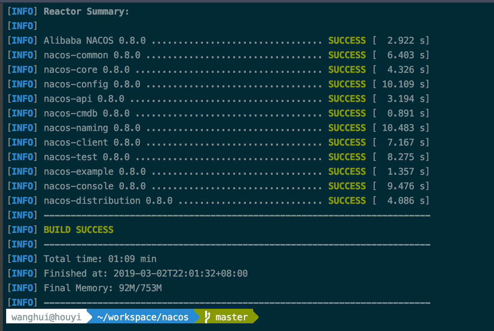

然后在项目的 distribution 目录下我们就可以找到可执行程序了，包括两个压缩包，这两个压缩包就是nacos 的 github 官网上发布的 Release 包。

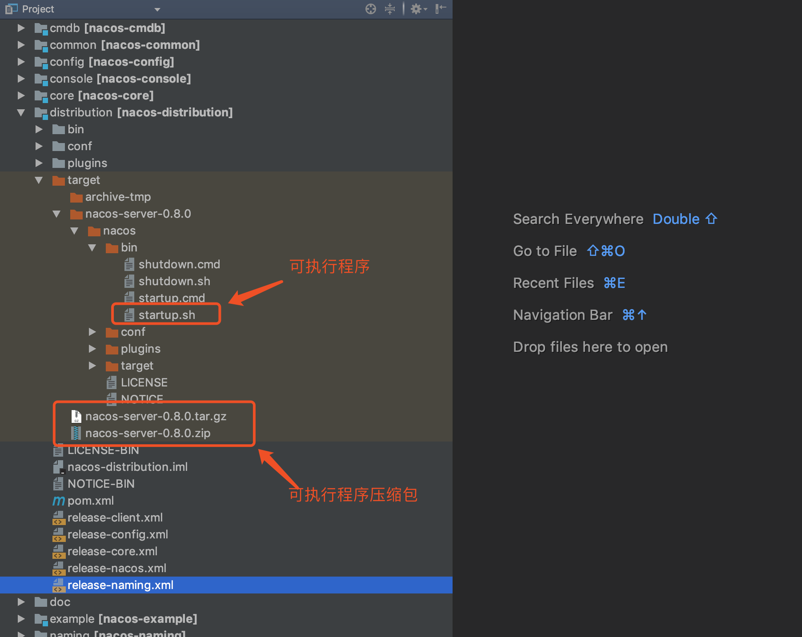

接下来我们把编译好的两个压缩包拷贝出来，然后解压出来直接使用，这样就相当于我们下载了 Release 包了。解压后文件结构和 nacos-server-0.8.0 一样，我们直接执行 startup.sh 即可启动一个单机的 Nacos 服务端了。

### 启动服务端

执行下列命令来启动一个 Nacos 服务端：

``` sh
sh startup.sh -m standalone
```

启动完你将会看到如下图所示的结果：

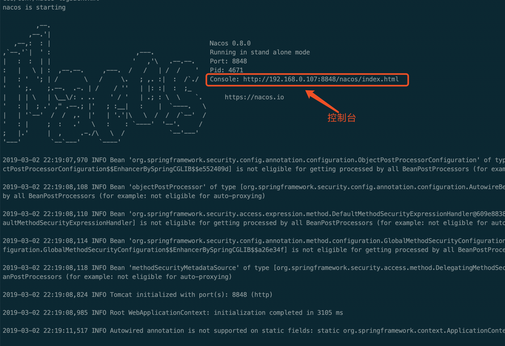

启动成功后，我们就可以访问 Nacos 的控制台了，如下图所示：

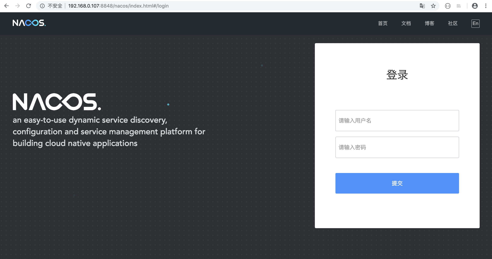

控制台做了简单的权限控制，默认的账号和密码都是 nacos。

登录进去之后，是这样的：

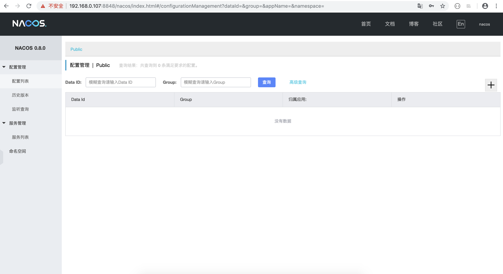

### 新建配置

接下来我们在控制台上创建一个简单的配置项，如下图所示：

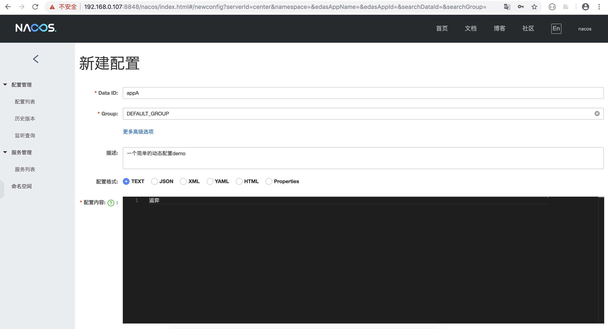

### 启动客户端

当服务端以及配置项都准备好之后，就可以创建客户端了，如下图所示新建一个 Nacos 的 ConfigService 来接收数据：

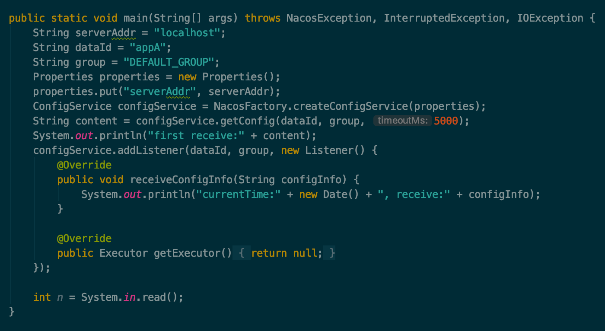

执行后将打印如下信息：

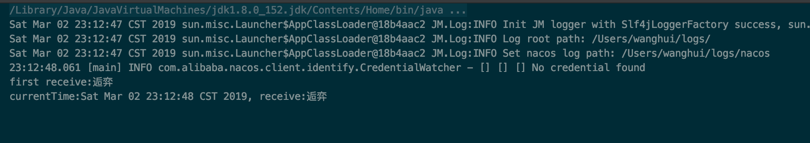

这里我用了一个 System.in.read() 方法来监听输入的信息，主要是为了防止主线程退出，看不到后续的结果。

### 修改配置信息

接下来我们在 Nacos 的控制台上将我们的配置信息改为如下图所示：

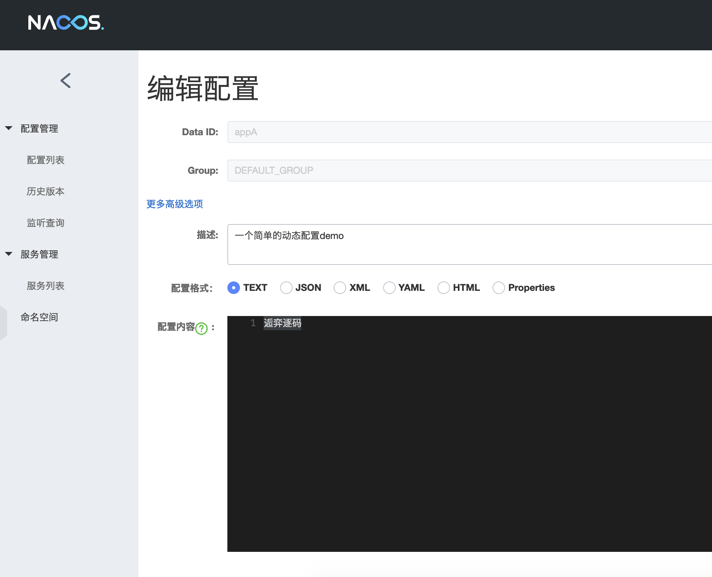

修改完配置，点击 “发布” 按钮后，客户端将会收到最新的数据，如下图所示：

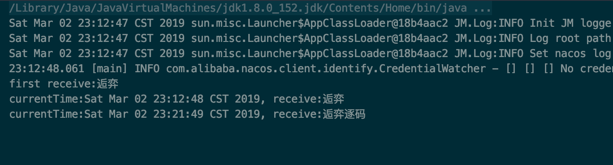

至此一个简单的动态配置管理功能已经讲完了，删除配置和更新配置操作类似，这里不再赘述。


## 适用场景

了解了动态配置管理的效果之后，我们知道了大概的原理了，Nacos 服务端保存了配置信息，客户端连接到服务端之后，根据 dataID，group可以获取到具体的配置信息，当服务端的配置发生变更时，客户端会收到通知。当客户端拿到变更后的最新配置信息后，就可以做自己的处理了，这非常有用，所有需要使用配置的场景都可以通过 Nacos 来进行管理。

可以说 Nacos 有很多的适用场景，包括但不限于以下这些情况：

- 数据库连接信息
- 限流规则和降级开关
- 流量的动态调度

看过我的 Sentinel 系列文章的同学可能知道，其中有一篇专门介绍集群限流环境搭建的文章，就是通过 Nacos 来创建动态规则的。


## 推还是拉

现在我们了解了 Nacos 的配置管理的功能了，但是有一个问题我们需要弄明白，那就是 Nacos 客户端是怎么实时获取到 Nacos 服务端的最新数据的。

其实客户端和服务端之间的数据交互，无外乎两种情况：

- 服务端推数据给客户端
- 客户端从服务端拉数据

那到底是推还是拉呢，从 Nacos 客户端通过 Listener 来接收最新数据的这个做法来看，感觉像是服务端推的数据，但是不能想当然，要想知道答案，最快最准确的方法就是从源码中去寻找。

### 创建 ConfigService 

从我们的 demo 中可以知道，首先是创建了一个 ConfigService。而 ConfigService 是通过 ConfigFactory 类创建的，如下图所示：

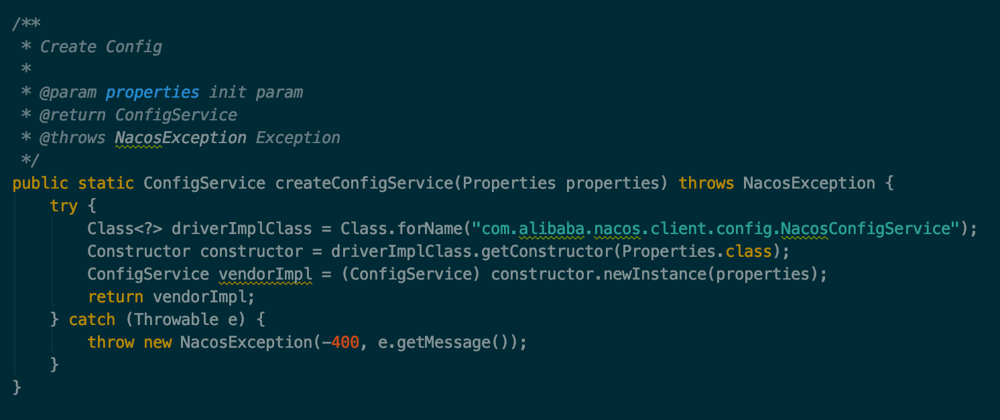

可以看到实际是通过反射调用了 NacosConfigService 的构造方法来创建 ConfigService 的，而且是有一个 Properties 参数的构造方法。

需要注意的是，这里并没有通过单例或者缓存技术，也就是说每次调用都会重新创建一个 ConfigService的实例。

### 实例化 ConfigService

现在我们来看下 NacosConfigService 的构造方法，看看 ConfigService 是怎么实例化的，如下图所示：

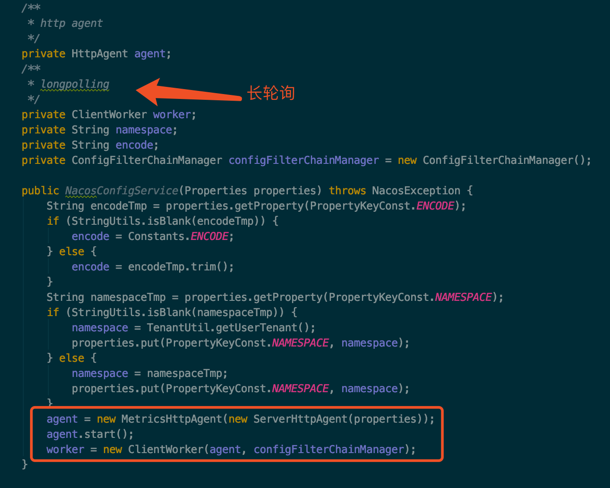

实例化时主要是初始化了两个对象，他们分别是：

- HttpAgent
- ClientWorker

#### HttpAgent

其中 agent 是通过装饰着模式实现的，ServerHttpAgent 是实际工作的类，MetricsHttpAgent 在内部也是调用了 ServerHttpAgent 的方法，另外加上了一些统计操作，所以我们只需要关心 ServerHttpAgent 的功能就可以了。

agent 实际是在 ClientWorker 中发挥能力的，下面我们来看下 ClientWorker 类。

#### ClientWorker

以下是 ClientWorker 的构造方法，如下图所示：


可以看到 ClientWorker 除了将 HttpAgent 维持在自己内部，还创建了两个线程池：

第一个线程池是只拥有一个线程用来执行定时任务的 executor，executor 每隔 10ms 就会执行一次 checkConfigInfo() 方法，从方法名上可以知道是每 10 ms 检查一次配置信息。

第二个线程池是一个普通的线程池，从 ThreadFactory 的名称可以看到这个线程池是做长轮询的。

现在让我们来看下 executor 每 10ms 执行的方法到底是干什么的，如下图所示：


可以看到，checkConfigInfo 方法是取出了一批任务，然后提交给 executorService 线程池去执行，执行的任务就是 LongPollingRunnable，每个任务都有一个 taskId。

现在我们来看看 LongPollingRunnable 做了什么，主要分为两部分，第一部分是检查本地的配置信息，第二部分是获取服务端的配置信息然后更新到本地。

**1.本地检查**

首先取出与该 taskId 相关的 CacheData，然后对 CacheData 进行检查，包括本地配置检查和监听器的 md5 检查，本地检查主要是做一个故障容错，当服务端挂掉后，Nacos 客户端可以从本地的文件系统中获取相关的配置信息，如下图所示：

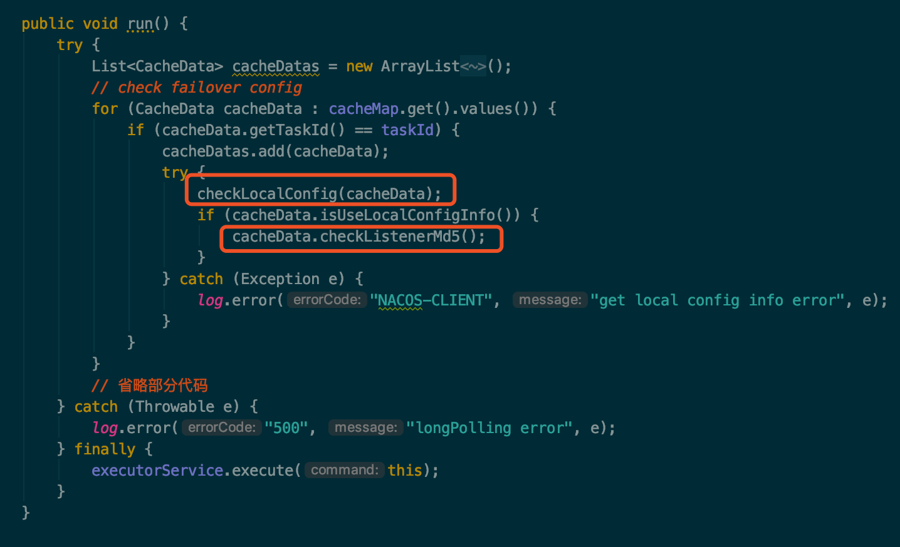

通过跟踪 checkLocalConfig 方法，可以看到 Nacos 将配置信息保存在了

 ~/nacos/config/fixed-{address}_8848_nacos/snapshot/DEFAULT_GROUP/{dataId} 

这个文件中，我们看下这个文件中保存的内容，如下图所示：

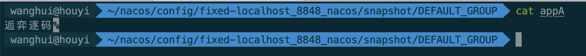

**2.服务端检查**

然后通过 checkUpdateDataIds() 方法从服务端获取那些值发生了变化的 dataId 列表，

通过 getServerConfig 方法，根据 dataId 到服务端获取最新的配置信息，接着将最新的配置信息保存到 CacheData 中。

最后调用 CacheData 的 checkListenerMd5 方法，可以看到该方法在第一部分也被调用过，我们需要重点关注一下。

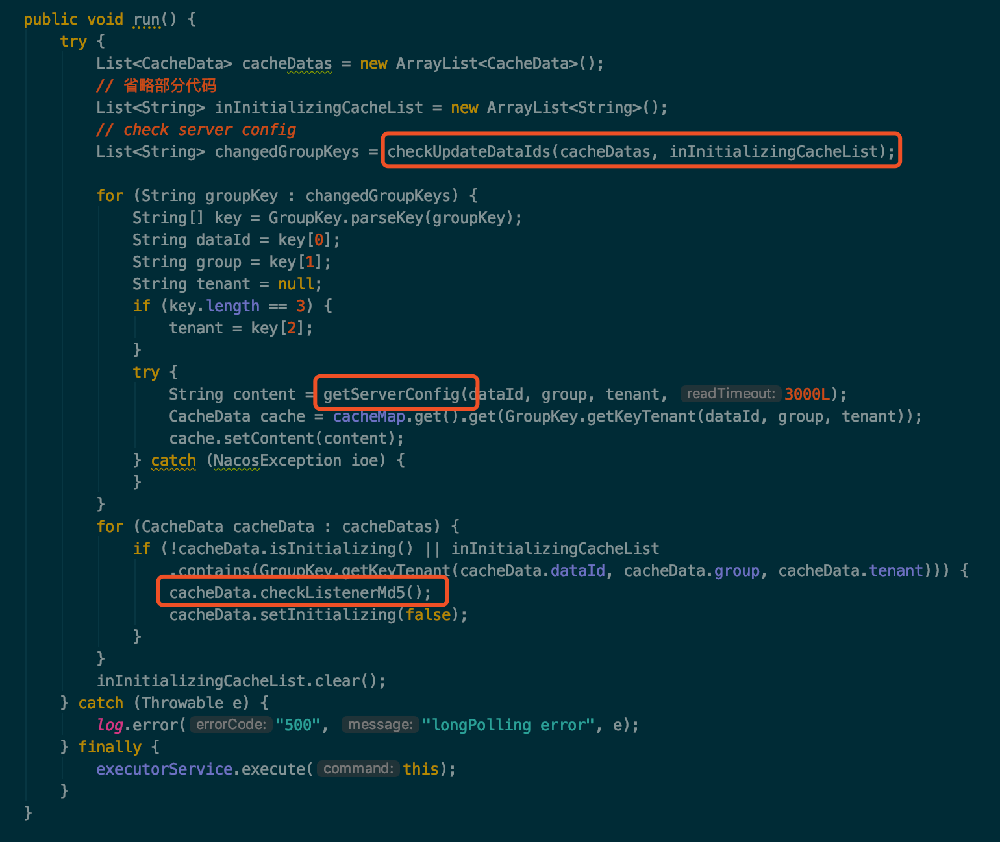

可以看到，在该任务的最后，也就是在 finally 中又重新通过 executorService 提交了本任务。

### 添加 Listener

好了现在我们可以为 ConfigService 来添加一个 Listener 了，最终是调用了 ClientWorker 的 addTenantListeners 方法，如下图所示：

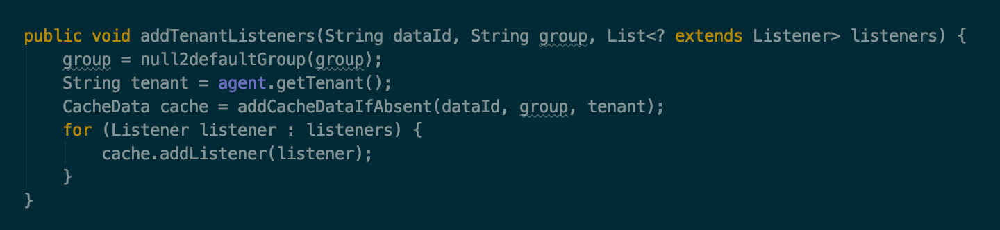

该方法分为两个部分，首先根据 dataId，group 和当前的场景获取一个 CacheData 对象，然后将当前要添加的 listener 对象添加到 CacheData 中去。

也就是说 listener 最终是被这里的 CacheData 所持有了，那 listener 的回调方法 receiveConfigInfo 就应该是在 CacheData 中触发的。

我们发现 CacheData 是出现频率非常高的一个类，在 LongPollingRunnable 的任务中，几乎所有的方法都围绕着 CacheData 类，现在添加 Listener 的时候，实际上该 Listener 也被委托给了 CacheData，那我们要重点关注下 CacheData 类了。

### CacheData

首先让我们来看一下 CacheData 中的成员变量，如下图所示：

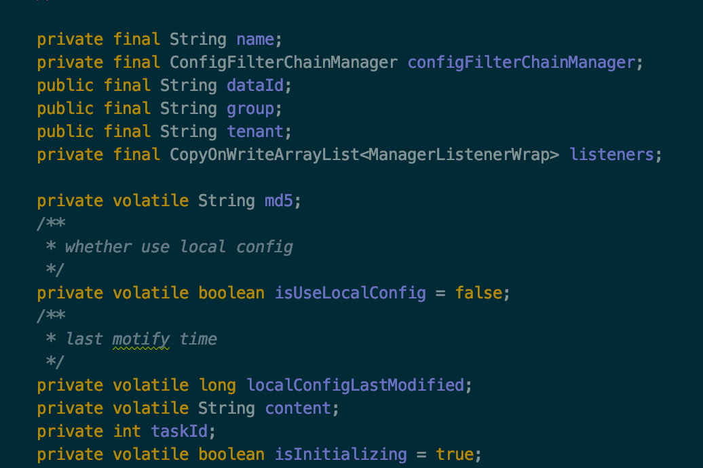

可以看到除了 dataId，group，content，taskId 这些跟配置相关的属性，还有两个比较重要的属性：listeners、md5。

listeners 是该 CacheData 所关联的所有 listener，不过不是保存的原始的 Listener 对象，而是包装后的 ManagerListenerWrap 对象，该对象除了持有 Listener 对象，还持有了一个 lastCallMd5 属性。

另外一个属性 md5 就是根据当前对象的 content 计算出来的 md5 值。

### 触发回调

现在我们对 ConfigService 有了大致的了解了，现在剩下最后一个重要的问题还没有答案，那就是 ConfigService 的 Listener 是在什么时候触发回调方法 receiveConfigInfo 的。

现在让我们回过头来想一下，在 ClientWorker 中的定时任务中，启动了一个长轮询的任务：LongPollingRunnable，该任务多次执行了 cacheData.checkListenerMd5() 方法，那现在就让我们来看下这个方法到底做了些什么，如下图所示：

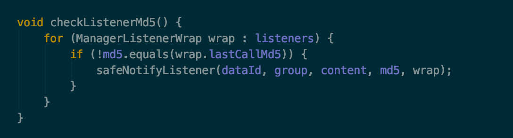

到这里应该就比较清晰了，该方法会检查 CacheData 当前的 md5 与 CacheData 持有的所有 Listener 中保存的 md5 的值是否一致，如果不一致，就执行一个安全的监听器的通知方法：safeNotifyListener，通知什么呢？我们可以大胆的猜一下，应该是通知 Listener 的使用者，该 Listener 所关注的配置信息已经发生改变了。现在让我们来看一下 safeNotifyListener 方法，如下图所示：

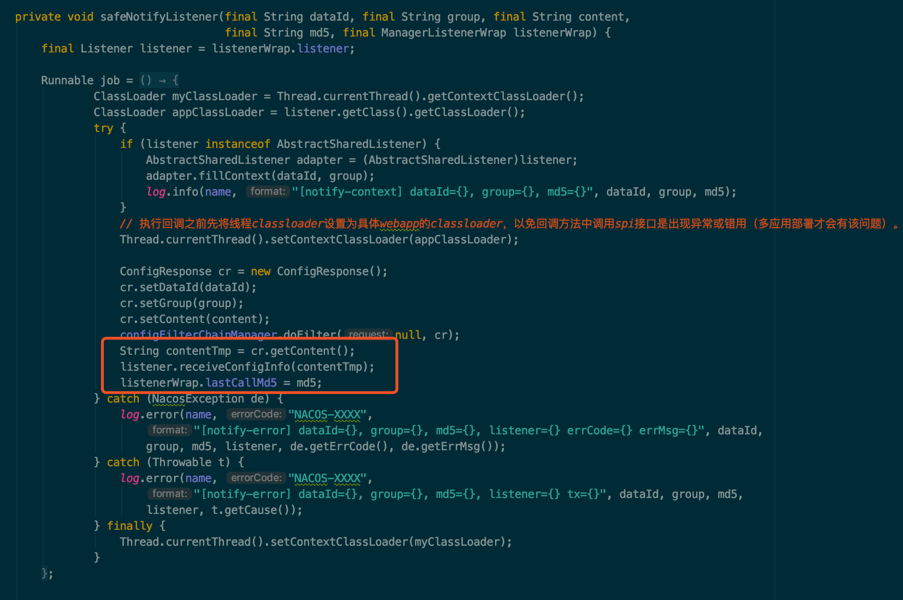

可以看到在 safeNotifyListener 方法中，重点关注下红框中的三行代码：获取最新的配置信息，调用 Listener 的回调方法，将最新的配置信息作为参数传入，这样 Listener 的使用者就能接收到变更后的配置信息了，最后更新 ListenerWrap 的 md5 值。和我们猜测的一样， Listener 的回调方法就是在该方法中触发的。

### Md5何时变更

那 CacheData 的 md5 值是何时发生改变的呢？我们可以回想一下，在上面的 LongPollingRunnable 所执行的任务中，在获取服务端发生变更的配置信息时，将最新的 content 数据写入了 CacheData 中，我们可以看下该方法如下：

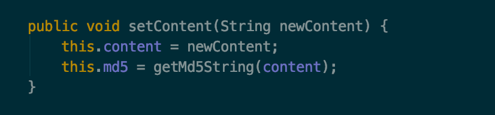

可以看到是在长轮询的任务中，当服务端配置信息发生变更时，客户端将最新的数据获取下来之后，保存在了 CacheData 中，同时更新了该 CacheData 的 md5 值，所以当下次执行 checkListenerMd5 方法时，就会发现当前 listener 所持有的 md5 值已经和 CacheData 的 md5 值不一样了，也就意味着服务端的配置信息发生改变了，这时就需要将最新的数据通知给 Listener 的持有者。

至此配置中心的完整流程已经分析完毕了，可以发现，Nacos 并不是通过推的方式将服务端最新的配置信息发送给客户端的，而是客户端维护了一个长轮询的任务，定时去拉取发生变更的配置信息，然后将最新的数据推送给 Listener 的持有者。

### 拉的优势

客户端拉取服务端的数据与服务端推送数据给客户端相比，优势在哪呢，为什么 Nacos 不设计成主动推送数据，而是要客户端去拉取呢？如果用推的方式，服务端需要维持与客户端的长连接，这样的话需要耗费大量的资源，并且还需要考虑连接的有效性，例如需要通过心跳来维持两者之间的连接。而用拉的方式，客户端只需要通过一个无状态的 http 请求即可获取到服务端的数据。

### 数据更新时延

服务端数据更新后，客户端接收到通知的时延到底有多久呢？


## 总结

Nacos 服务端创建了相关的配置项后，客户端就可以进行监听了。

客户端是通过一个定时任务来检查自己监听的配置项的数据的，一旦服务端的数据发生变化时，客户端将会获取到最新的数据，并将最新的数据保存在一个 CacheData 对象中，然后会重新计算 CacheData 的 md5 属性的值，此时就会对该 CacheData 所绑定的 Listener 触发 receiveConfigInfo 回调。

考虑到服务端故障的问题，客户端将最新数据获取后会保存在本地的 snapshot 文件中，以后会优先从文件中获取配置信息的值。


## 配置信息持久化

现在我们了解了客户端的相关细节，服务端是如何保存配置信息的我们在后续的文章中进行介绍，可以知道的一点是，Nacos 服务端存储数据默认是基于 derby 数据库的。


## 多个客户端

目前我们是使用了一个 ConfigService 客户端，如果我们启用多个 ConfigService 客户端会怎样呢？