## Nacos 服务注册与发现原理分析

Nacos 另一个非常重要的特性就是服务注册与发现，说到服务的注册与发现相信大家应该都不陌生，在微服务盛行的今天，服务是非常重要的，而在 Nacos 中服务更被称为他的一等公民。

Nacos 支持几乎所有主流类型的 “服务” 的发现、配置和管理。

了解过 Dubbo 的同学，应该对 Dubbo 的架构非常熟悉，最经典的一张架构图如下所示：

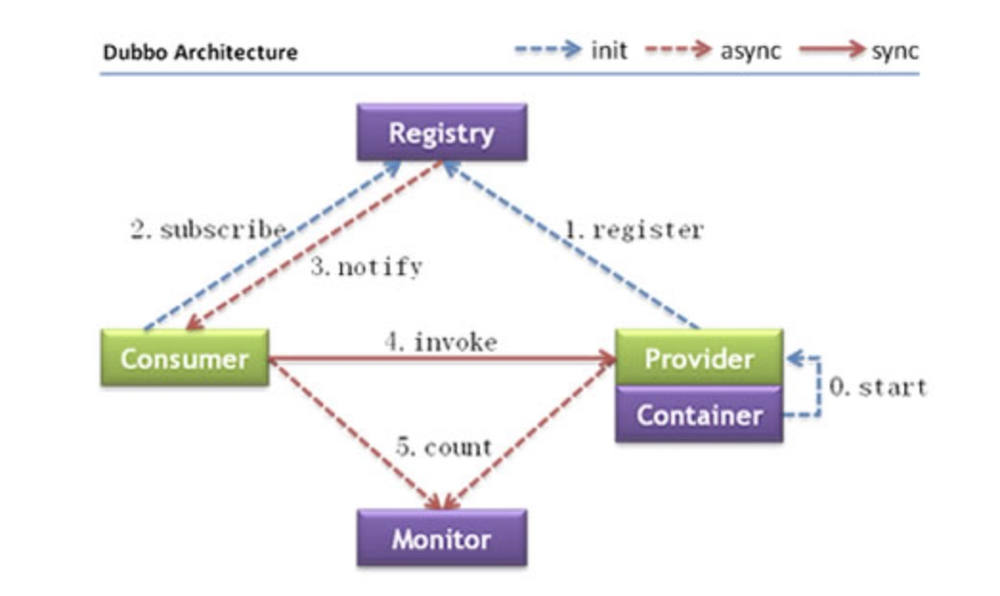

图中的6个步骤的含义解释如下：

0、服务容器负责启动，加载，运行服务提供者。
1、服务提供者在启动时，向注册中心注册自己提供的服务。
2、服务消费者在启动时，向注册中心订阅自己所需的服务。
3、注册中心返回服务提供者地址列表给消费者，如果有变更，注册中心将基于长连接推送变更数据给消费者。
4、服务消费者，从提供者地址列表中，基于软负载均衡算法，选一台提供者进行调用，如果调用失败，再选另一台调用。
5、服务消费者和提供者，在内存中累计调用次数和调用时间，定时每分钟发送一次统计数据到监控中心。

其中图中最上方的 Registry 就是注册中心，负责服务的注册与发现。Dubbo 有自己的 Registry 实现，而 Nacos 则是另一种 Registry 的实现。

现在我们来了解下 Nacos 的服务注册与发现，首先在本地将 Nacos 服务端启动起来，具体怎么操作这里不在赘述，不清楚的同学可以参考我的其他文章。

## 模拟服务注册

我们模拟将同一个服务的两个实例注册到 Nacos 中，代码如下图所示：

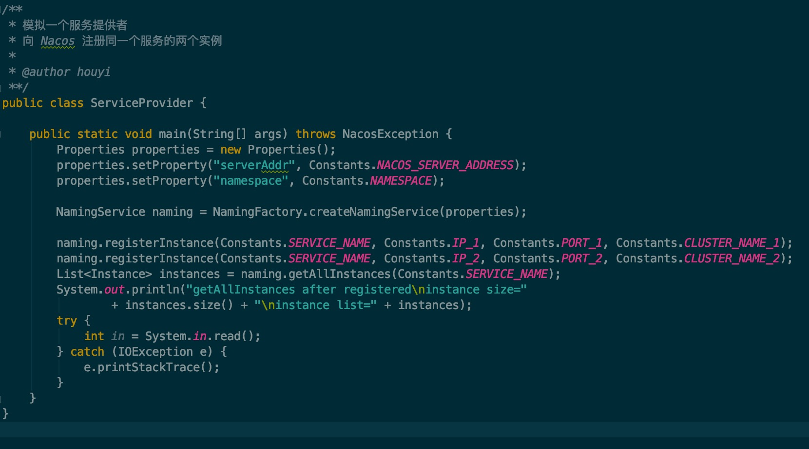

通过 NamingService 接口的 registerInstance 方法就可以将服务进行注册了，该方法有很多重载的方法，这里我们选择一个简单的来调用就好了。

注册完成后，通过调用 getAllInstances 方法，立即获取所有可用的实例，然后让主线程等待，打印如下：

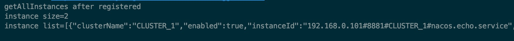

从打印结果中可以发现 naming 客户端成功获取到了两个实例。

## 模拟服务发现

服务注册之后，服务的消费者就可以向注册中心订阅自己所需要的服务了，注册中心会将所有服务的实例“推送”给消费者，这里我在推送上打了引号，原因是实际上获取服务是客户端主动轮询的，跟客户端获取配置中心的配置项的原理一样。这里不进行具体的描述，有兴趣的可以跟一下代码就知道了。

现在我创建一个服务消费者，然后向注册中心订阅一个服务，当接收到注册中心返回的服务列表之后，执行5次 select 服务实例的操作，相当于进行一个模拟的服务请求，具体的代码如下图所示：

其中的 printInstances 方法主要是打印出所有服务的实例，为了节省篇幅就不写出来了，将 ServiceConsumer 类启动之后，打印出如下的日志：

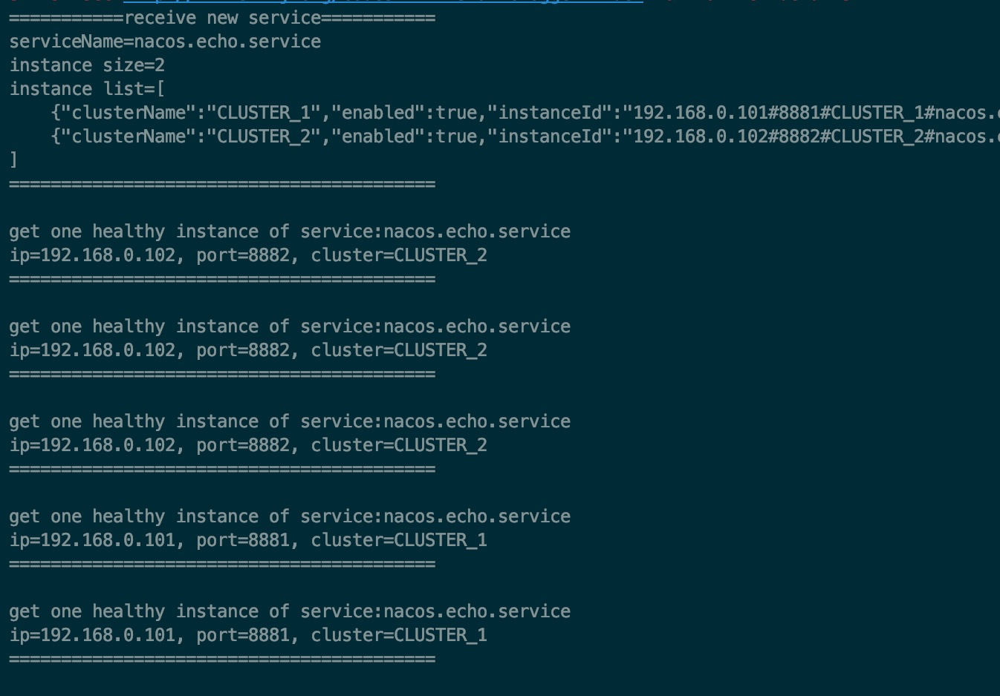

消费者每次获取一个健康的实例进行调用，接下来我就来分析下整个服务注册与发现的过程和大致的设计原理和思路。

## 服务如何注册

服务注册最重要的就是将服务注册到哪里，在注册中心服务端，肯定有一个用来管理服务的容器，他保存着所有服务的实例。

我们暂时不需要知道该容器具体的实现细节，只需要知道有这样一个概念。

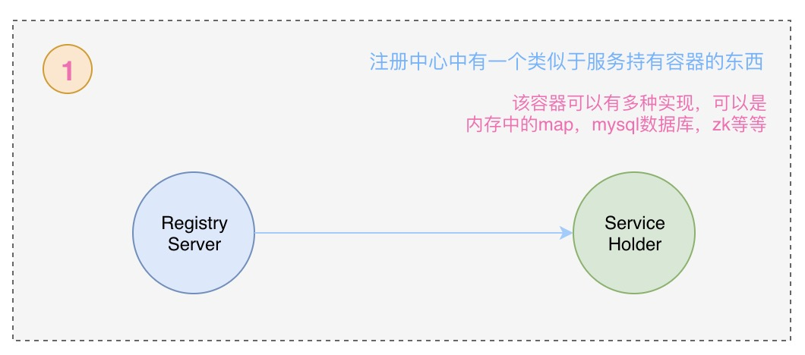

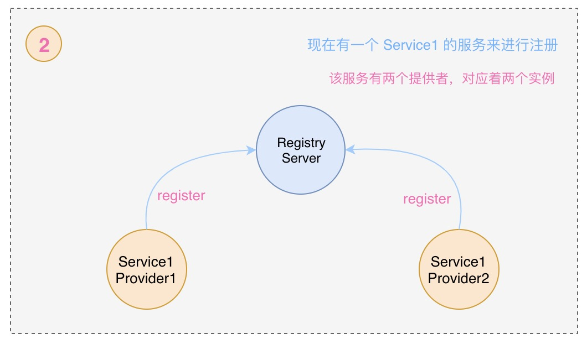

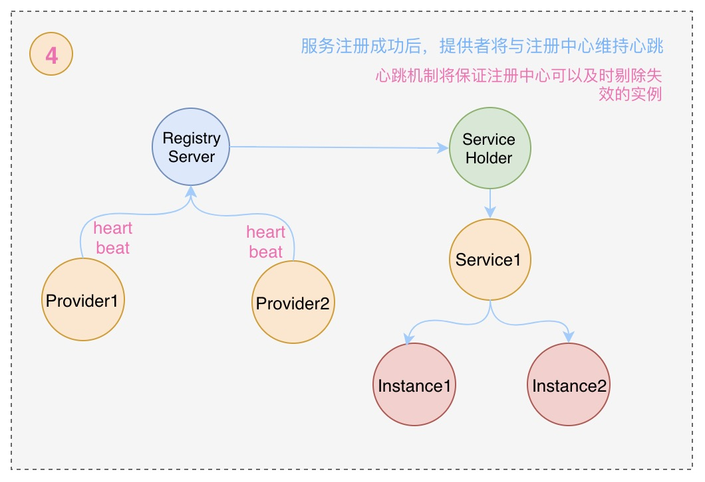

### 服务如何发现

服务注册到注册中心后，服务的消费者就可以进行服务发现的流程了，消费者可以直接向注册中心发送获取某个服务实例的请求，这种情况下注册中心将返回所有可用的服务实例给消费者，但是一般不推荐这种情况。另一种方法就是服务的消费者向注册中心订阅某个服务，并提交一个监听器，当注册中心中服务发生变更时，监听器会收到通知，这时消费者更新本地的服务实例列表，以保证所有的服务均是可用的。

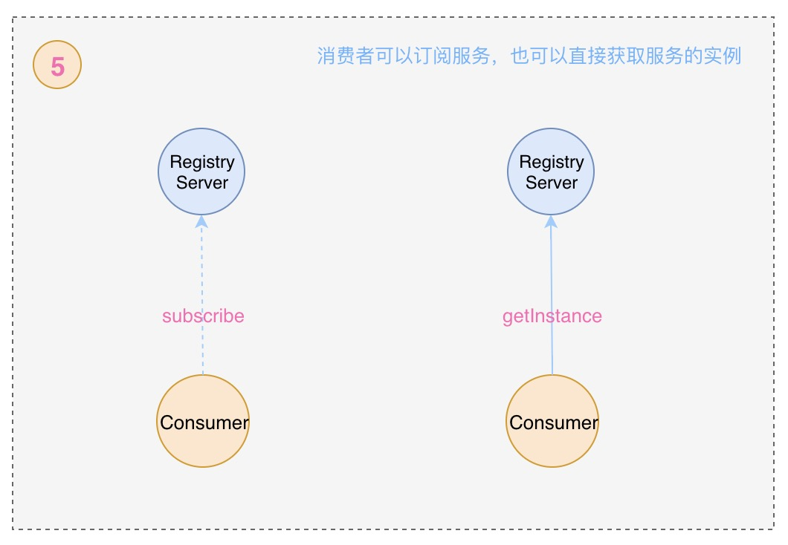

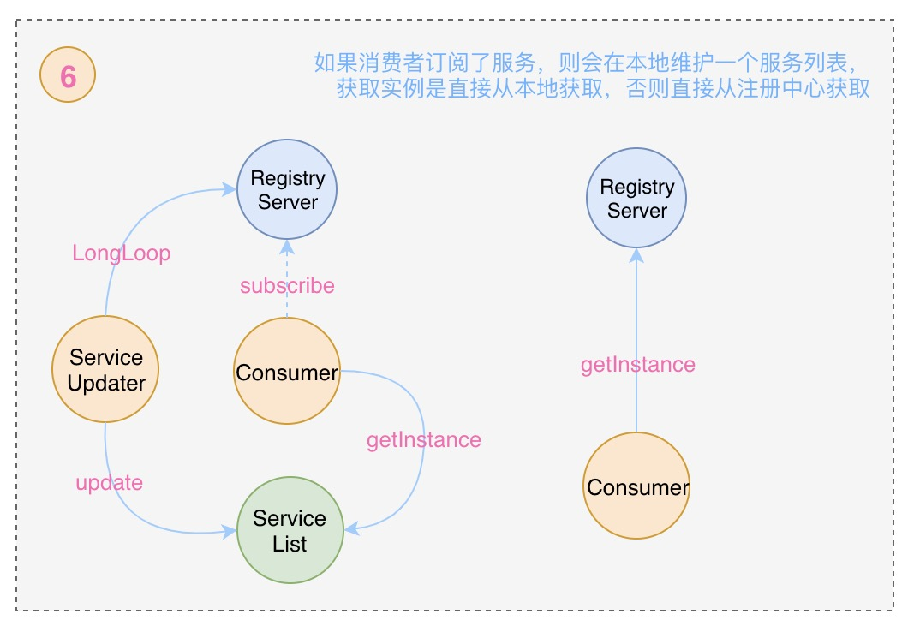

### 负载均衡

负载均衡有很多中实现方式，包括轮询法，随机方法法，对请求ip做hash后取模等等，从负载的维度考虑又分为：服务端负载均衡和客户端负载均衡。

Nacos 的客户端在获取到服务的完整实例列表后，会在客户端进行负载均衡算法来获取一个可用的实例，模式使用的是随机获取的方式。

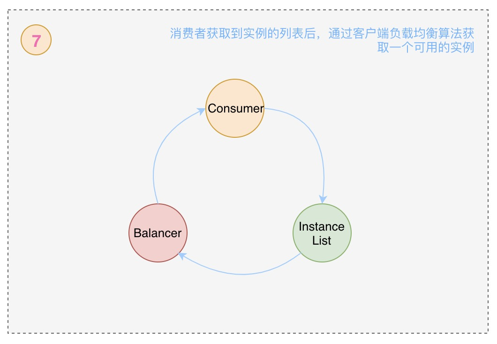

### Nacos 服务注册与订阅的完整流程

Nacos 客户端进行服务注册有两个部分组成，一个是将服务信息注册到服务端，另一个是像服务端发送心跳包，这两个操作都是通过 NamingProxy 和服务端进行数据交互的。

Nacos 客户端进行服务订阅时也有两部分组成，一个是不断从服务端查询可用服务实例的定时任务，另一个是不断从已变服务队列中取出服务并通知 EventListener 持有者的定时任务。

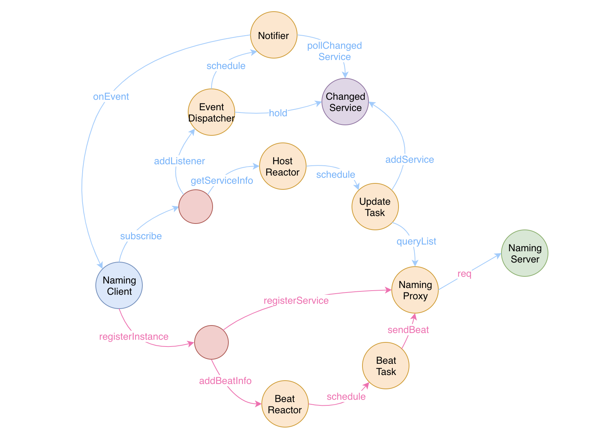

官方提供的demo具有一定的迷惑性，不过这能迫使你去了解事物的本质。 

你如果直接官方的demo，你会发现如下有趣的情况：

1、第一次注册了两个实例，获取实例时返回的是2个

2、然后解除注册其中的一个实例，再次获取实例时返回的还是2个

3、订阅服务的监听器将会收到两次 onEvent 回调，第一次是2个实例，第二次是1个实例

按照正常的情况，注册了两个实例，然后解除注册了一个只会，再次获取实例应该返回1个实例才对，但是返回了2个。

深入了解下源码就能知道原因：

客户端将获取到的服务实例保存在一个 map 中，而该 map 中的内容是由调度任务定时去更新的，存在一定的延时。

